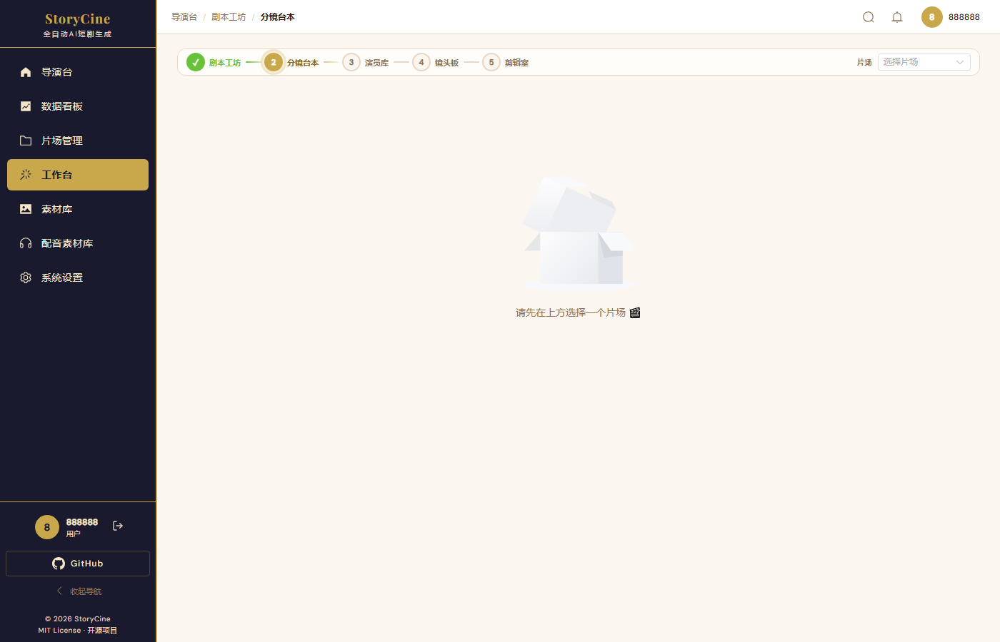

# 分镜台本

分镜台本是创作流程的第 2 步，负责**编辑每个分镜的参数 + AI 智能补全**。

## 界面布局

```
┌─ 标题 ─ 保存 ─ 字数 ─ AI智能补全 ─ 同步 ─ 导出 ─ 镜头数 ─┐
├─ 剧集胶囊：第1集 初遇  第2集 对峙 ...                       ┤
│                             │  导演设定（右侧）              │
│  镜号 1  [场景][时间]       │  - 画面比例                  │
│  [景别][构图][运镜]         │  - 风格参考                  │
│  [光影][音效][时长]         │  - 画质/光影/画风           │
│  [人物][氛围][绑定主体]     │                              │
│  分镜描述                   │                              │
│  台词表格（角色/对话/动作） │                              │
│                             │                              │
│  镜号 2  ...                │                              │
│                             │                              │
│  + 添加新镜头               │                              │
└─────────────────────────────────────────────────────────────┘
```



## 核心功能

### AI 智能补全

点击「**AI 智能补全**」，系统会：
- 分析每场戏的对话内容和情绪
- 自动填充空白字段：景别、运镜、构图、光影、音效、视角、时长
- 被补全的字段会有**金色高亮**（带 `✨ AI已优化` 标记）
- 支持**撤消/重做**（工具栏  ↩ / ↪ 按钮）

### 保存分镜

点击「**保存分镜**」或按 `Ctrl+S`，数据存储到 MongoDB。

### 同步至故事板

点击「**同步至故事板**」将当前分镜推送到镜头板，自动生成图片/视频提示词。

### 导出

支持导出为 **PNG 图片**（完整分镜表截图）。
