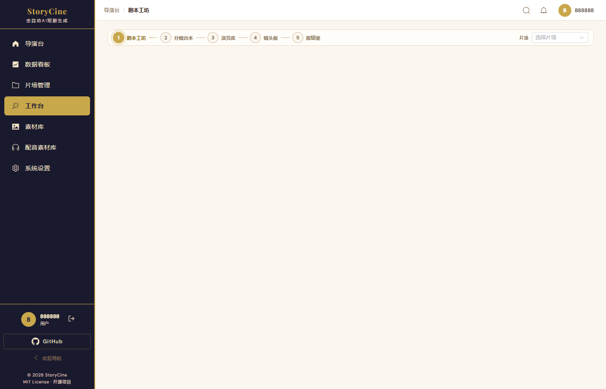

# 剧本工坊

剧本工坊是创作流程的第 1 步，负责**选题材标签 → AI 生成完整剧本**。

## 界面布局

```
┌─────────────┬──────────────────────────────┐
│  题材标签    │      创作记录 / 进度条        │
│  - 快捷模板  │                              │
│  - 题材      │                              │
│  - 热门梗    │                              │
│  - 类型      │                              │
│  - 风格      │                              │
│  AI 开写剧本 │                              │
└─────────────┴──────────────────────────────┘
```



## 创作流程

1. 在左侧面板选择创作标签：
   - **捷径**：点击快捷模板（如"悬疑短篇"）一键填充所有标签
   - **题材**：悬疑推理 / 言情 / 科幻 / 古装 ...
   - **热门梗**：多选，如"重生"、"穿越"、"替身"
   - **类型/风格**：辅助分类

2. 点击「**AI 开写剧本**」，7 个 Agent 依次工作：
   - 标签解析 → 大纲 → 人物 → 剧情架构 → 撰写 → 校验 → 完成

3. 创作记录区域显示已完成的所有集

## 续写

已有剧本后，点击「**续写下一集**」，AI 基于前文上下文自动延续剧情。

## 导入剧本

点击「**导入已有剧本**」按钮（创作标签标题旁），支持：
- **格式导入**：粘贴结构化剧本（场次/时间/地点/人物/台词）
- **故事转剧本**：粘贴小说/故事片段，AI 改编为标准剧本格式
